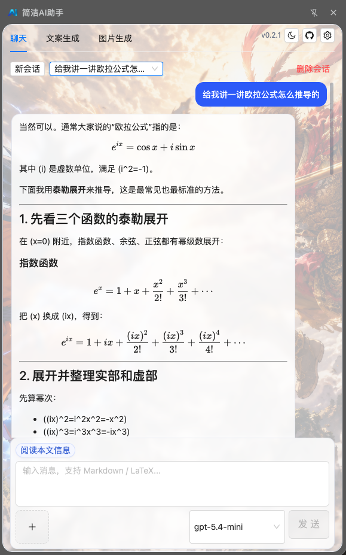
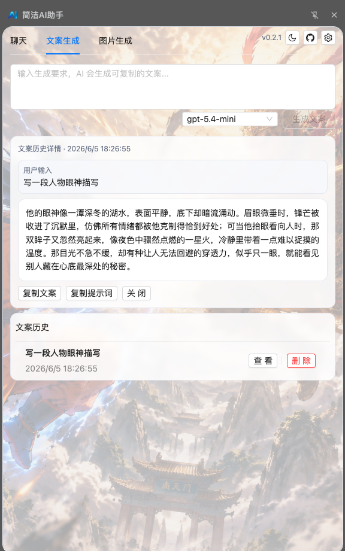
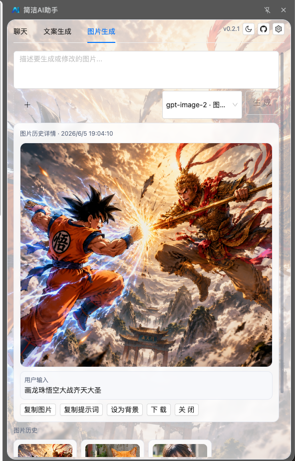
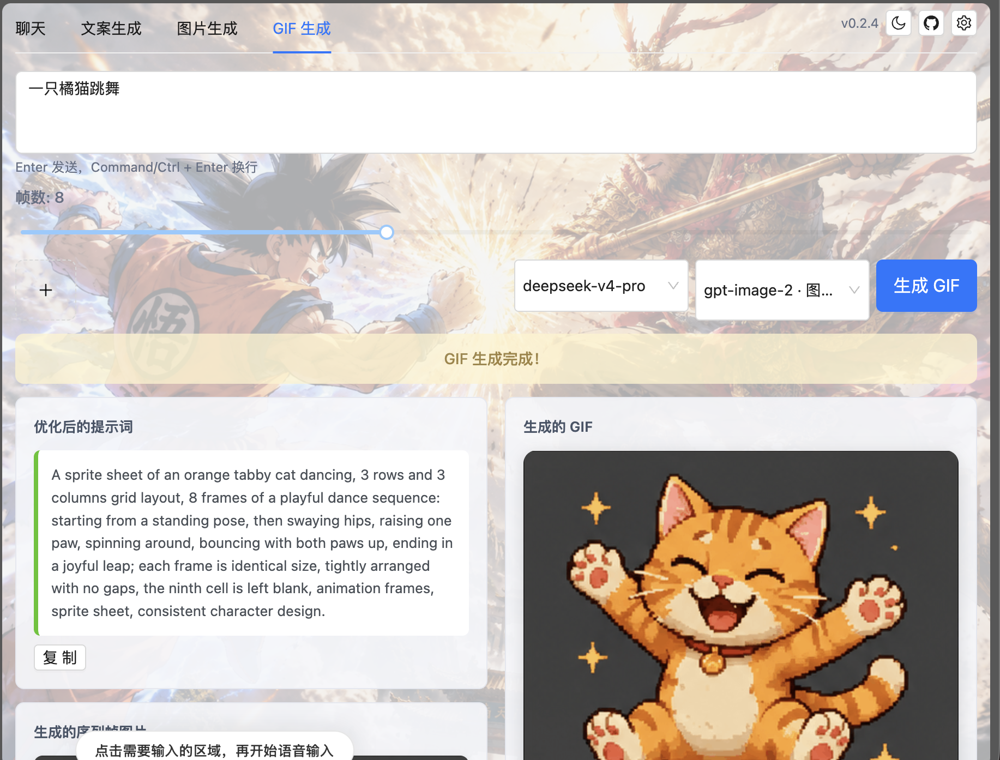
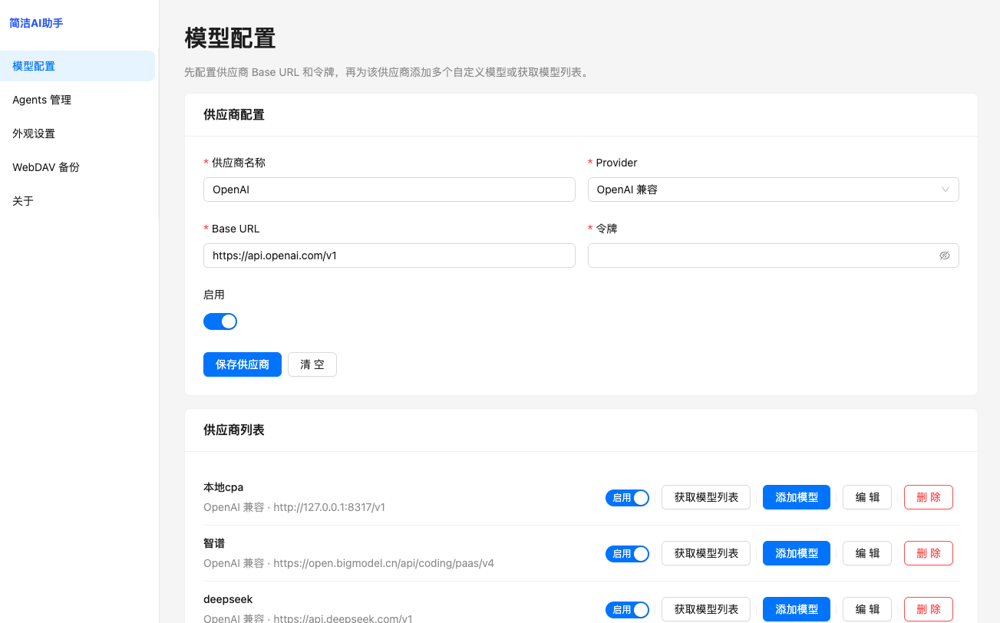

# 简洁AI助手（Simple AI Assistant）

简洁AI助手 是一个 Chrome Manifest V3 扩展，以 Side Panel 形式提供页面感知的 AI 聊天、文案生成、图片生成和 GIF 动画生成能力。

## 界面预览

### 聊天助手

在浏览器 Side Panel 中与 AI 对话，可结合当前页面标题、URL、选中文本和正文内容进行问答。聊天内容支持 Markdown、LaTeX 公式、PlantUML 和 Mermaid 渲染，代码块支持语法高亮和一键复制。



### 文案生成

独立的文案生成工作区，支持复制生成结果、查看历史记录和复用提示词。



### 图片生成

支持图片生成、参考图编辑、历史图片查看、复制、下载和设置为面板背景。



### GIF 生成

AI 驱动的 GIF 动画生成工作流，自动优化提示词、生成序列帧、切割图片并合成 GIF。支持 3-16 帧可调、历史记录管理、一键复制和下载。



#### 生成示例

<p align="center">
  
  
</p>

### 模型设置

在设置页管理供应商、模型能力、默认模型和模型列表缓存，支持 OpenAI-compatible 和本地模型服务。



## 主要能力

- Side Panel AI 聊天面板。
- 读取当前页面标题、URL、选中文本和正文内容，并结合页面上下文对话。
- 支持配置多个大模型，并在聊天页按能力切换模型。
- 支持文本、视觉、图片生成和图片编辑能力标签。
- 支持 OpenAI-compatible 文本聊天接口。
- 支持 OpenAI-compatible 图片生成和图片编辑接口，例如 `gpt-image-2`。
- **AI GIF 生成**：自动优化提示词、生成网格序列帧、智能切割并合成 GIF 动画。
- 支持配置页管理模型配置、供应商模型列表缓存和 Agents 预设。支持本地模型服务。
- 支持 WebDAV 手动备份和恢复模型配置、Agents 预设和应用设置。
- 支持可配置输入快捷键，可选择 Enter 发送或 Command/Ctrl + Enter 发送。
- 支持浅色/深色主题、面板背景图、历史背景预览、复制和导出。
- 支持扩展图标和工具栏图标。

## 站点能力

- Content script 可匹配任意页面，用于读取当前页面标题、URL、选中文本和正文内容。
- 支持把当前页面上下文带入聊天，让 AI 更容易理解正在浏览的内容。

## 配置与数据存储

模型配置保存在扩展自己的 `chrome.storage.local` 中，不是网页 `localStorage`。

模型配置包含：

- 显示名称
- Provider
- 模型 ID
- Base URL
- API Key
- 能力标签
- 默认模型设置
- 启用状态

WebDAV 配置也保存在 `chrome.storage.local` 中。WebDAV 备份文件会包含模型配置、Agents 预设、应用设置和 API Key，请确认 WebDAV 服务可信且账号安全。

## WebDAV 备份

配置页支持：

- 保存 WebDAV 地址、用户名、密码和备份文件路径。
- 测试 WebDAV 连接。
- 手动立即备份当前模型配置、Agents 预设和应用设置。
- 从备份恢复并覆盖本地模型配置、Agents 预设和应用设置。

默认备份路径：

```text
simple-ai-assistant-crx/configs.json
```

## 开发

安装依赖：

```bash
npm install
```

开发模式：

```bash
npm run dev
```

构建扩展：

```bash
npm run build
```

构建产物输出到 `dist/`，可在 Chrome 扩展管理页加载该目录。

## 发布与安装

推送任意 tag 会触发 GitHub Actions 自动构建，并把 `dist/` 打包成 `.zip`、`.tar.gz`、`.tar.bz2` 后发布到 GitHub Release。

```bash
git tag v0.2.4
git push origin v0.2.4
```

安装 Release 包：

1. 在 GitHub Release 下载压缩包，推荐下载 `.zip`。
2. 解压压缩包，得到类似 `simple-ai-assistant-crx-v0.2.4/` 的目录。
3. 打开 Chrome 扩展管理页：`chrome://extensions/`。
4. 开启右上角“开发者模式”。
5. 点击“加载已解压的扩展程序”，选择解压后的目录；也可以把解压后的目录拖入扩展管理页。

更新 Release 包：

1. 不要删除旧扩展。
2. 下载新版 Release 压缩包并解压。
3. 用新版文件覆盖原来的扩展目录，或保持固定目录重新加载新版目录。
4. 在 `chrome://extensions/` 点击该扩展卡片上的“重新加载”。

扩展已在 `manifest.json` 固定 `key`，用于在开发者模式下保持扩展 ID 稳定。只要扩展 ID 不变，`chrome.storage.local` 和 IndexedDB 中的模型配置、Agents 和历史缓存会继续保留。

## 项目结构

```text
src/
  background/      Background service worker、模型配置存储、WebDAV、Provider 调度
  content/         通用页面、语雀 content scripts
  options/         配置页
  providers/       AI Provider adapters
  shared/          共享类型、消息协议、工具函数
  sidepanel/       Side Panel 聊天 UI
  sites/           站点适配定义
public/
  manifest.json    Chrome 扩展 manifest
  icons/           扩展图标
```

## 注意事项

- Anthropic provider 已预留，但尚未实现真实 API 调用。
- WebDAV 备份不会自动创建不存在的父目录。

## 🙏 致谢

感谢真诚、友善、团结、专业的 [LinuxDo](https://linux.do) 社区，让我学到那么多有关 AI 相关知识。

LinuxDo — 学 AI, 上 L 站!

## License

[MIT](LICENSE)
